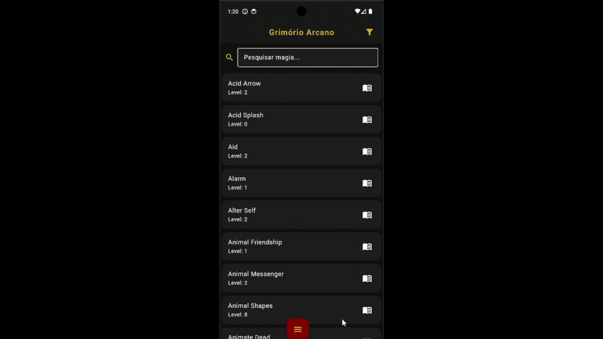

# Grimório Arcano

Aplicativo desenvolvido em Flutter que funciona como um grimório digital para Dungeons & Dragons 5ª edição.

O app permite consultar magias oficiais do sistema, visualizar detalhes, marcar favoritas e criar magias personalizadas.
Os dados são obtidos através da API pública de D&D 5e e armazenados localmente para melhorar o desempenho e permitir uso offline.

## Features
- Consulta de magias do sistema D&D 5e
- Busca por nome
- Filtros por nível e escola de magia
- Visualização detalhada das magias
- Sistema de magias favoritas
- Criação de magias personalizadas
- Sistema de fichas de personagem
- Inventário de itens
- Funcionamento offline após o primeiro carregamento

API utilizada: [D&D 5e API](https://www.dnd5eapi.co/)

## Sobre o desenvolvimento
Este projeto foi desenvolvido como forma de estudo em desenvolvimento mobile com Flutter.

Durante o desenvolvimento foram explorados conceitos como consumo de APIs, persistência local de dados e organização de interface para aplicações mobile.

## Demo

  
  

